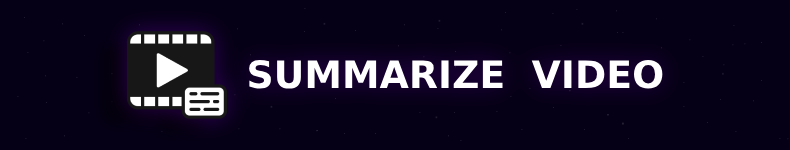

# YouTube Transcript 📄  


[](https://chrome.google.com/webstore)
[](https://developer.chrome.com/docs/extensions/mv3/)
[](LICENSE)

YouTube Transcript is a Chrome extension that fetches the transcript of the currently playing YouTube video and optionally summarizes it using OpenAI. Works directly from a popup UI.

---

## Features ✨

- **Transcript Extraction**: Instantly pull the full transcript from a YouTube video.
- **Timestamps**: Option to include or remove timestamps.
- **Summarization**: Condense long transcripts using OpenAI's GPT model.
- **Popup Interface**: Clean and simple interface for quick use.
- **No Reload Needed**: Runs directly on the active video tab.

---

## Installation 🛠️

1. Clone or download this repo:
   ```bash
   git clone https://github.com/yourusername/youtube-transcript-extension.git
   ```

2. Open Chrome and go to:
   ```
   chrome://extensions/
   ```

3. Enable **Developer Mode** (top-right toggle).

4. Click **"Load unpacked"** and select the project folder.

5. You're done. The extension icon should now be visible.

---

## Usage 📖

1. Go to any YouTube video page.
2. Click the extension icon.
3. Hit **"Load Transcript"**.
4. Choose:
   - ✅ *Include Timestamps*
   - 🤖 *Summarize Transcript* (uses OpenAI API)
5. View results in the text area.

---

## Configuration ⚙️

To enable summarization, replace `API_KEY_HERE` in `popup.js` with your OpenAI API key:

```js
"Authorization": "Bearer YOUR_API_KEY"
```

---

## File Structure 📂

```plaintext
.
├── background.js               # Handles script injection to open transcript
├── content.js                  # Scrapes transcript from YouTube DOM
├── manifest.json               # Chrome extension config (Manifest V3)
├── popup.html                  # UI layout for popup
├── popup.js                    # Main popup logic + API call
├── icons/                      # Icon set for the extension
│   ├── icon16.png
│   ├── icon48.png
│   └── icon128.png
```

---

## Screenshots 🖼️

> You can add screenshots of the popup here for better demo.

---

## License 📝

This project is licensed under the **MIT License**